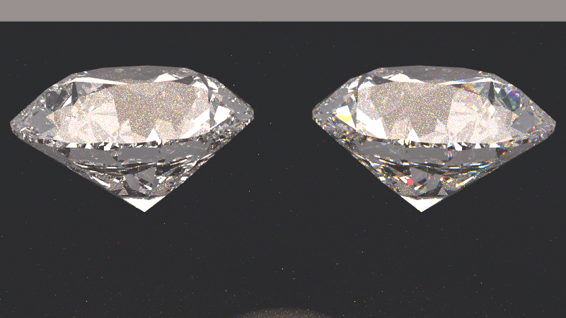

# PathTracer - Advanced Ray Tracing Renderer

A comprehensive C++ ray tracing engine featuring advanced geometry, spectral rendering, and professional-grade rendering capabilities. Supports complex meshes, procedural geometry, and chromatic dispersion effects.


*Beautiful crystal wine glasses showcasing advanced light refraction and realistic glass materials.*

## Overview

This renderer implements fundamental ray tracing concepts including:
- **Ray-object intersection** (spheres)
- **Material simulation** (Lambertian, metal, dielectric/glass)
- **Anti-aliasing** through multi-sampling
- **Depth of field** with camera defocus
- **Global illumination** through recursive ray bouncing

## Features

### Rendering Capabilities
- **Progressive sampling**: Configurable samples per pixel for noise reduction
- **Depth of field**: Realistic camera blur effects
- **Material types**:
  - Lambertian (matte/diffuse surfaces)
  - Metal (reflective surfaces with controllable fuzziness)
  - Dielectric (glass/transparent materials with refraction)
- **Anti-aliasing**: Multi-sample anti-aliasing (MSAA)
- **Global illumination**: Physically-based light bouncing


*Advanced spectral rendering demonstrating chromatic dispersion effects in glass materials.*

### Camera System
- **Configurable field of view**
- **Positionable camera** with look-at functionality
- **Defocus blur** for depth of field effects
- **Aspect ratio control**

## Architecture

### Core Components

#### Vector Mathematics (`vec3.h`)
- 3D vector operations (addition, multiplication, cross/dot products)
- Point representation using `point3` alias
- Utility functions for reflection, refraction, and random sampling

#### Ray System (`ray.h`)
- Ray representation with origin and direction
- Ray-at-parameter evaluation

#### Hittable Objects (`hittable.h`, `sphere.h`)
- Abstract hittable interface
- Sphere primitive with ray intersection
- Hit record system storing intersection data

#### Materials (`material.h`)
- **Lambertian**: Diffuse reflection with random scattering
- **Metal**: Specular reflection with configurable fuzziness
- **Dielectric**: Refraction and reflection based on Snell's law and Fresnel equations

#### Camera (`camera.h`)
- Ray generation for each pixel
- Multi-sampling for anti-aliasing
- Defocus disk sampling for depth of field
- Recursive ray tracing with configurable bounce depth

#### Color System (`color.h`)
- Linear to gamma color space conversion
- PPM format output

### Scene Management (`hittable_list.h`)
- Container for multiple hittable objects
- Efficient ray-scene intersection testing

## Build Instructions

### Prerequisites
- CMake 3.10 or higher
- C++20 compatible compiler (GCC, Clang, or MSVC)

### Building

```bash
# Configure build system
cmake -B build

# Build the project
cmake --build build

# For optimized release builds
cmake --build build --config release
```

### Running

```bash
# Run with scene selection
./build/bin/PathTracer [scene] > output.ppm

# Available scenes:
./build/bin/PathTracer classic     # Classic ray tracing scene
./build/bin/PathTracer diamond     # High-quality diamond showcase
./build/bin/PathTracer geometry    # Geometry demonstration
./build/bin/PathTracer dispersion  # Spectral dispersion effects

# Show help
./build/bin/PathTracer help
```

The output is a PPM format image that can be viewed with image viewers supporting this format.

## Configuration

### Camera Settings (in `main.cpp`)

```cpp
cam.aspect_ratio      = 16.0 / 9.0;    // Image aspect ratio
cam.image_width       = 1200;          // Image width in pixels
cam.samples_per_pixel = 10;            // Anti-aliasing samples
cam.max_depth         = 20;            // Max ray bounce depth

cam.vfov     = 20;                     // Vertical field of view (degrees)
cam.lookfrom = point3(13,2,3);         // Camera position
cam.lookat   = point3(0,0,0);          // Look-at point
cam.vup      = vec3(0,1,0);            // Up direction

cam.defocus_angle = 0.6;               // Depth of field strength
cam.focus_dist    = 10.0;              // Focus distance
```

### Performance vs Quality Trade-offs

- **samples_per_pixel**: Higher values reduce noise but increase render time
- **max_depth**: More bounces improve realism but slow rendering
- **image_width**: Higher resolution improves detail but increases render time quadratically

## Current Scene

The default scene (`main.cpp:11-69`) renders:
- **Ground plane**: Large sphere acting as ground (Lambertian material)
- **Random spheres**: Grid of randomly placed spheres with varied materials
- **Hero spheres**: Three prominent spheres showcasing different materials
  - Large glass sphere (dielectric, refractive index 1.5)
  - Large matte sphere (Lambertian, brown color)
  - Large metal sphere (polished metal)

## Technical Details

### Ray Tracing Algorithm

1. **Ray Generation**: For each pixel, generate multiple rays with slight randomization
2. **Intersection Testing**: Test ray against all objects in scene
3. **Material Interaction**: Calculate scattered rays and color attenuation
4. **Recursive Tracing**: Follow scattered rays up to maximum depth
5. **Color Accumulation**: Combine colors from all ray paths
6. **Anti-aliasing**: Average multiple samples per pixel

### Material Physics

- **Lambertian**: Perfect diffuse scattering using cosine-weighted hemisphere sampling
- **Metal**: Mirror reflection with optional fuzzing for brushed metal effects
- **Dielectric**: Implements Snell's law for refraction and Fresnel equations for reflection/transmission balance


*Side-by-side comparison showing regular glass (left) versus dispersive glass with chromatic effects (right).*

### Performance Characteristics

- **Computational Complexity**: O(n × pixels × samples × depth) where n is object count
- **Memory Usage**: Minimal - scene data and stack depth for recursion
- **Parallelization**: Easily parallelizable per-pixel (not implemented in this version)

## File Structure

```
├── src/
│   ├── main.cpp              # Main entry point with scene selection
│   ├── core/                 # Core rendering system
│   │   ├── camera.h          # Camera system and ray generation
│   │   ├── vec3.h            # 3D vector mathematics
│   │   ├── ray.h             # Ray representation
│   │   ├── hittable.h        # Hittable object interface
│   │   ├── color.h           # Color handling and output
│   │   ├── spectral.h        # Spectral rendering system
│   │   └── common.h          # Common headers and utilities
│   ├── geometry/             # Geometric primitives
│   │   ├── sphere.h          # Sphere primitive
│   │   ├── triangle.h        # Triangle primitive
│   │   ├── mesh.h            # Mesh container
│   │   ├── diamond.h         # Procedural diamond generation
│   │   └── bvh.h             # Bounding volume hierarchy
│   ├── materials/            # Material system
│   │   └── material.h        # Material types and light interaction
│   ├── io/                   # Input/output systems
│   │   └── obj_loader.h      # Wavefront OBJ file loader
│   └── scenes/               # Scene definitions
│       ├── main.cpp          # Classic ray tracing scenes
│       ├── diamond_*.cpp     # Diamond showcase scenes
│       └── dispersion_*.cpp  # Spectral dispersion demos
├── assets/                   # Asset files (models, textures)
├── docs/                     # Documentation
├── examples/                 # Example scenes and usage
├── benchmarks/               # Performance benchmarking tools
├── tools/                    # Build and utility scripts
└── CMakeLists.txt            # Build configuration
```

## Gallery


*Multiple glass spheres demonstrating various dispersion effects and light interactions.*



*High-resolution render showcasing detailed spectral dispersion and caustic light patterns.*


*Complex scene with multiple dispersive objects creating intricate rainbow patterns.*

## Future Enhancements

Potential improvements for this renderer:

### Performance
- Multi-threading support
- GPU acceleration (CUDA/OpenCL)
- Spatial acceleration structures (BVH, KD-tree)

### Features
- Additional primitives (triangles, planes, boxes)
- Texture mapping
- Area lights and soft shadows
- Volumetric rendering
- Motion blur
- Advanced materials (subsurface scattering, emission)

### Output
- Support for additional image formats (PNG, JPEG)
- HDR output
- Real-time preview

## Learning Resources

This implementation closely follows:
- ["Ray Tracing in One Weekend"](https://raytracing.github.io/books/RayTracingInOneWeekend.html) by Peter Shirley
- Follow-up books: "Ray Tracing: The Next Week" and "Ray Tracing: The Rest of Your Life"

## License

[Specify your license here]